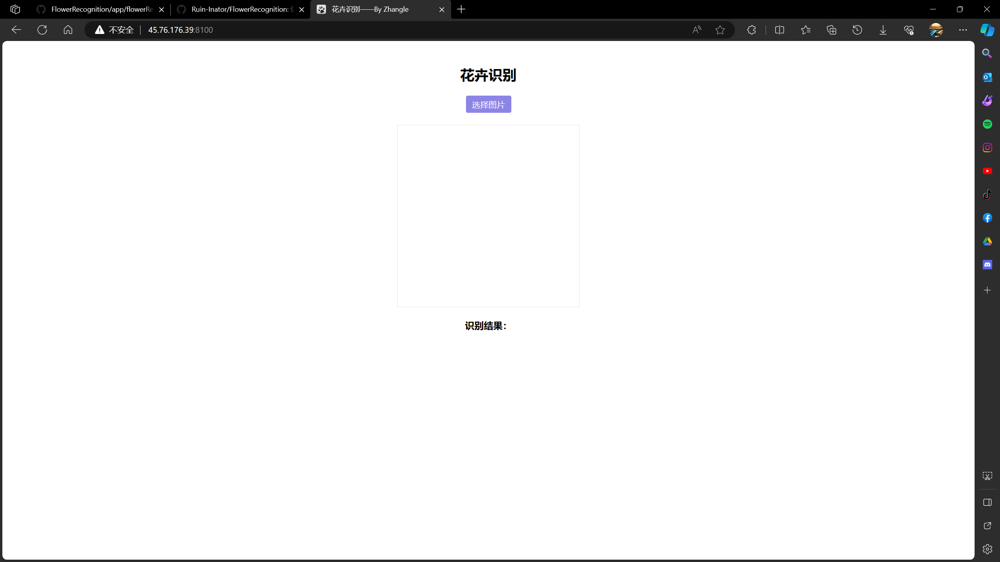
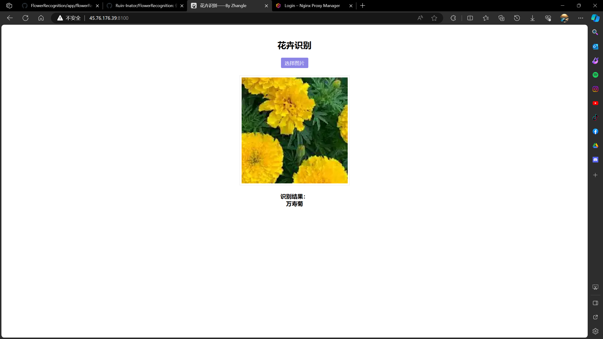

懒得做？让你半小时完成课设！！

# 购买云服务器(10分钟)

1. 选择腾讯云或者阿里云(不过本人使用的是Vultr)
2. 购买虚拟云服务器，区域选择日本或者新加坡(配置环境省心)
3. 选择最低配置就行，系统选择CentOS 7
4. 防火墙打开8100端口，比如阿里云，在阿里云对应虚拟机的安全组里面打开8100端口，协议tcp，授权对象为"0.0.0.0"，实在不会可以google查一下
5. 用网页端的命令行窗口就行了，就是点击"远程连接"按钮，探索看看进入网页命令行
6. 输入登录密码，开始部署吧

# 部署项目

## 安装项目(5分钟)
```
yum install git

git clone https://github.com/Ruin-Inator/FlowerRecognition.git

cd FlowerRecognition
```

## 启动项目
```
chmod +x onestep.sh&&./onestep.sh
```

## 浏览器访问(5分钟)

- 访问浏览器的```xx.xx.xx.xx:8100``` (你的主机ip)
- 一切正常的话你会看到如下场景




到这里基本已经完成了，可以写报告了


## 域名搭建(可不做，但是很装逼)

- 对于摆烂的同学来说可跳过这一步，毕竟我们只是蒙混过关，没必要复杂化
- 但是实话说```xx.xx.xx.xx:8100```这样访问太丑了
- 所以项目还内置了Nginx Proxy Manager，可以一键代理域名并https加密
- 当然你得先拥有一个域名
- 浏览器访问```xx.xx.xx.xx:81```进行配置
- 成功后你可以用```flower.com```这样的域名来访问了

### 如果你是第一次使用Nginx Proxy Manager，点击这里寻找教程
### https://www.youtube.com/results?search_query=nginx+proxy+manager%E6%95%99%E7%A8%8B

## 书写报告(10分钟)
- 这一切即将完成，现在只剩下报告了
- 关于项目的架构和说明点击[这里](./docs/project.md)
- 使用Chat GPT 3.5帮助，让你的速度更加的飞跃
- 演示的图片我放在docs文件夹下面，方便你使用

### 如果你是第一次使用Chat GPT，点击这里进入官网
### https://chat.openai.com/

## 最后的最后
- 你已经完成一切了，你已经很努力，现在是时候打游戏了
- 你的队友在游戏里面等着你呢，不要让他们失望
- 现在，忘记烦人的报告，打开你的游戏，开始奖励自己吧！！
